class: center, middle, inverse


# `r emo::ji("1st_place_medal")`

## Introducción al Diseño de Experimentos 


---


# Introducción 


```{r, echo=FALSE,fig.align='center', out.width = "600px"}
      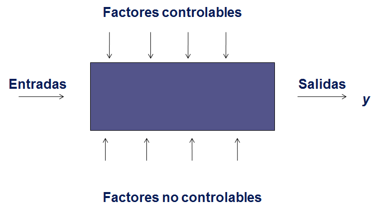
```

---

#  Variables

## Respuestas 

+ Es la variable en estudio, aquella cuyos cambios se desean estudiar.
+ Característica observada o medida en cada unidad experimental.
+ Variable dependiente.
+ Suele ser denotada cona la letra _Y_.

## Factores 

 + Cualquier variable nominalposible efecto sobre la respuesta se quiere estudiar.
 + Cada factor, se devide en  niveles, los cuales representan
categorías, valores o formas específicas se descompone un factor.

> ¿Cuál(es) serían la(s) variables de respuesta en un experimento
corto, donde se requiera evaluar el efecto del pH en el desarrollo
de _E. coli_?

---


## Algunos ejemplos

```{r, echo=FALSE,fig.align='center', out.width = "600px"}
      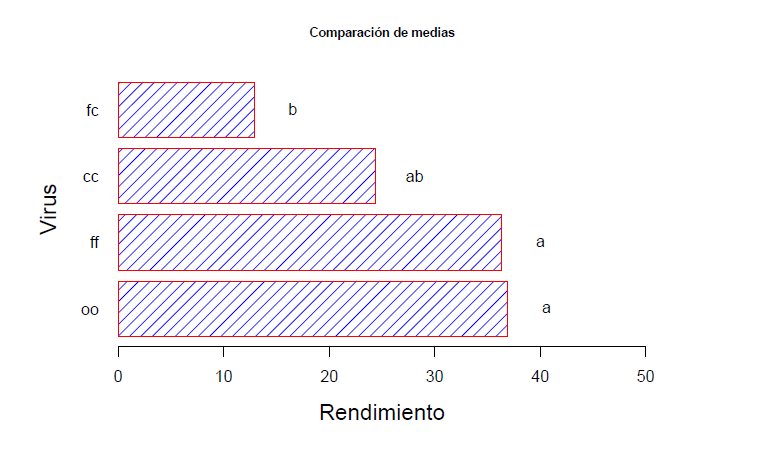
```

---

##  Veamos algunos ejemplos.... 


```{r, echo=FALSE,fig.align='center', out.width = "600px"}
      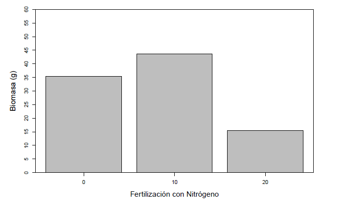
```

---
 


# Tipos de experimentos 

## Experimentos unifactoriales 

 + Estudia el efecto de un solo factor sobre la variable respuesta.


+ _Tratamientos_: Conjunto de condiciones experimentales que serán aplicadas a una unidad experimental en un diseño elegido.

```{r, echo=FALSE,fig.align='center', out.width = "500px"}
      
```


---

## Experimentos factoriales

Es aquel en el que se estudia simultáneamente más de un factor.


```{r, echo=FALSE,fig.align='center', out.width = "700px"}
      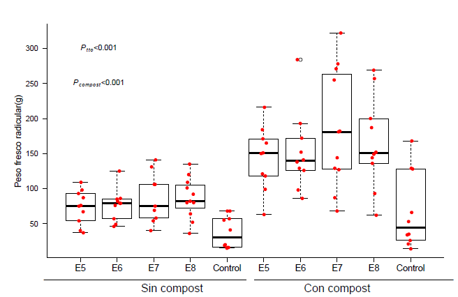
```

---

## Unidad experimental 

Entidad física que puede asignarse, al azar, a un tratamiento. 

```{r, echo=FALSE,fig.align='center', out.width = "700px"}
      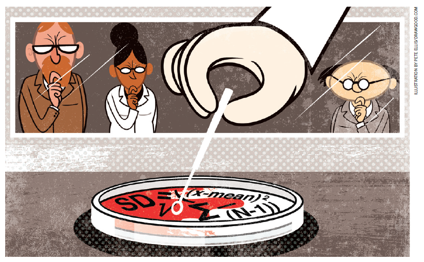
```

---

## Unidad experimental 

 + Caso 1. Considere un experimento donde se requiere evaluar el efecto que tiene el agua del río Medellín sobre lesiones en peces. Se establecieron 2 acuarios, cada uno con 50 peces. Los cuales fueron asignandos aleatoriamente a un tratamiento (contaminado vs. control). Después de 30 días,  se capturan 10 peces de cada acuario y se cuentan el número de lesiones. 
 
> ¿ Cuál sería la unidad experimental? 
 
---


# Unidad experimental 

## Caso 2. Suponga las dos siguients situaciones.. 

.pull-left[

El tratamiento es aplicado vía una inyección subcutanea. 

```{r, echo=FALSE,fig.align='center', out.width = "500px"}
      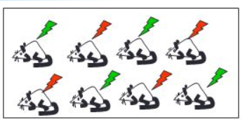
```

]

.pull-right[

En este estudio los animales son confinados en jaulas y son tratados con dos tipos de dietas. 

```{r, echo=FALSE,fig.align='center', out.width = "500px"}
      
```
]

> ¿Cuál sería la unidad experimental en cada uno de los casos? 

---


## Replicación 

```{r, echo=FALSE,fig.align='center', out.width = "700px"}
      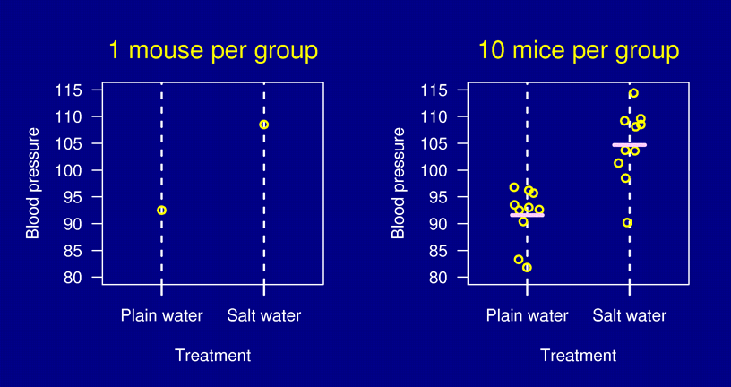
```

---


## Grupo control 

.pull-left[

- Se usa como una medida
de línea de base.

- Es idéntico a todos los
demás elementos que se
están estudiando, con la
excepción de que no recibe
el tratamiento o la
manipulación experimental
que los grupos de interés. 
]

.pull-right[
```{r, echo=FALSE,fig.align='center', out.width = "450px"}
      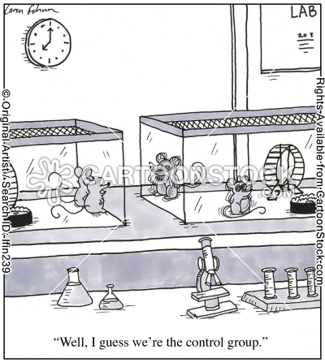
```
]


---

## Aleatorización 

```{r, echo=FALSE,fig.align='center', out.width = "800px"}
      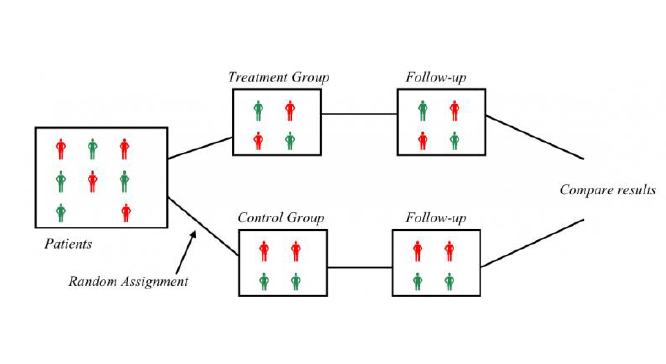
```

---

class: center, middle, inverse


# `r emo::ji("1st_place_medal")`

## ANOVA

```{r, echo=FALSE,fig.align='center', out.width = "500px"}
      
```
---

# Introducción 


```{r Paquetes, include=FALSE}
library("pander")
library(multcomp)
library(car)
library(agricolae)
library(dplyr)
library(ggplot2)
library(ggpubr)
library(gridExtra)
```

```{r, echo=FALSE, fig.align='center'}

dat_Camp1<-read.csv('2017-02-22 Datos variables campo ciclo 1 (David A).csv',sep=';')

datCampc1<-tbl_df(dat_Camp1)
datCamC1<- group_by(datCampc1, Bloque,Tratamiento)

datCamp1<-summarize(datCamC1, count = n(), Tallos = mean(Tallos, na.rm = T), Dtallos = mean(D_tallo, na.rm = T), Flores=mean(Flores, na.rm = T), D_flor=mean(D_flor, na.rm = T), L_ped=mean(L_ped, na.rm = T),
                    Peso=mean(Peso, na.rm = T), Puntos=mean(Puntos, na.rm = T), L_tallo=mean(L_tallo, na.rm = T))

datCamp1$Tratamiento <- factor(datCamp1$Tratamiento,
                                levels=c('Nada','Hongos','Solarizada','Basamid'))


## Ciclo 1 
### Tallos 
ggplot(datCamp1, aes(Tratamiento, Tallos)) + 
  geom_boxplot(aes(fill = Tratamiento))  + 
  geom_jitter(position = position_jitter(width = .15), alpha=0.3, size=2) +
  xlab("Tratamiento") +
  ylab("Log(UFC/g)") +theme_bw() + theme(legend.position = "none",axis.title.x=element_text(size = 22), 
                                     axis.title.y = element_text(size = 22))
```

---


## ANOVA Unifactorial 

Se refiere a una clase de muestreo o diseños experimentales, en los   cuales la variable __predictora__ o __explicativa__ es   _categórica_ y la variable __respuesta__ es  __continua__.

```{r, echo=FALSE, fig.align='center', fig.height=6}
## Ciclo 1 
### Tallos 
ggplot(datCamp1, aes(Tratamiento, Tallos)) + 
  geom_boxplot(aes(fill = Tratamiento))  + 
  geom_jitter(position = position_jitter(width = .15), alpha=0.3, size=2) +
  xlab("Tratamiento") +
  ylab("Log(UFC/g)") +theme_bw() + theme(legend.position = "none",axis.title.x=element_text(size = 22), 
                                     axis.title.y = element_text(size = 22))
```

---

## ANOVA

Se fundamenta en la descomposición de la variación de una variable _respuesta_ $\bar{Y}$, entre la varainza explicada  y no   explicada por uno o varios factores.
 
 <span style="display:block; height: 2cm;"></span>
 
```{r, echo=FALSE,fig.align='center'}
      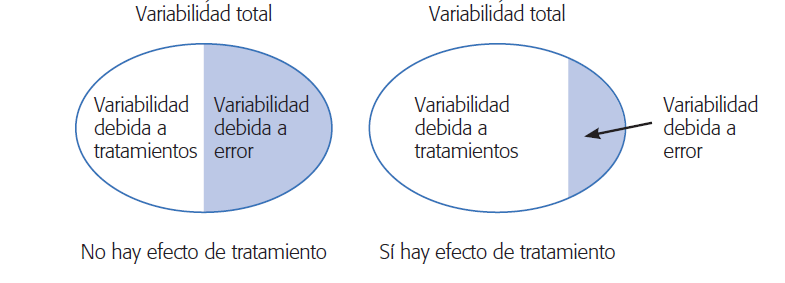
```

--- 

## ANOVA unifactorial: Objetivo

<span style="display:block; height: 2cm;"></span>
El `ANOVA` tiene como objetivos centrales:

+ Examinar la contribución relativa de cada una de las fuentes de variación, a la variabilidad total de $\bar{y}$.

+ Probar la hipótesis nula $(H_0)$, que la __media__ de los grupos o tratamientos son iguales. 

---


## ANOVA: Una aproximación gráfica 

Cuando analizamos los datos usando análisis de varianza, el primer paso
es poner a prueba la hipótesis nula global:

$$ H_0: \mu_1 = \mu_2 = \mu_3= .. \mu_I $$

> Contra


$$ H_a: \text{al menos una media difiere}$$ 

```{r, echo=FALSE, message=FALSE, warning=FALSE, fig.align='center',fig.height=4}
wdata = data.frame(
  Tratamiento = factor(rep(c("Nada", "Hongos", 'Solarizada', 'Basamid'), each=7)),
  UFC = c(rnorm(7, 5.2), rnorm(7, 5), rnorm(7, 5), rnorm(7, 5)))

ggdotplot(wdata, x='Tratamiento',y='UFC', xlab='Tratamiento',ylab='Log(UFC/g)', add='mean', color='Tratamiento')
```

---


## ANOVA: Comparando varianzas

Si la varianza __entre grupos__ es similar a la __dentro__ de los grupos: 

```{r, echo=FALSE, message=FALSE, warning=FALSE, fig.align='center'}
wdata3 = data.frame(
  Tratamiento = factor(rep(c("Nada", "Hongos", 'Solarizada', 'Basamid'), each=10)),
  UFC = c(rnorm(10, 4), rnorm(10, 4), rnorm(10, 4), rnorm(10, 4)))


ggdotplot(wdata3, x = "Tratamiento", y='UFC',
            add = "mean", rug = TRUE,
            fill = "Tratamiento",
             xlab = 'Tratamiento', ylab = 'UFC/g')
```


---

## ANOVA: Comparando varianzas

Si la varianza __entre grupos__ es similar a la __dentro__ de los grupos: 

```{r, echo=FALSE, message=FALSE, warning=FALSE, fig.align='center'}
wdata3 = data.frame(
  Tratamiento = factor(rep(c("Nada", "Hongos", 'Solarizada', 'Basamid'), each=200)),
  UFC = c(rnorm(200, 4), rnorm(200, 4), rnorm(200, 4), rnorm(200, 4)))


gghistogram(wdata3, x = "UFC",
            add = "mean", rug = TRUE,
            fill = "Tratamiento",
            add_density = TRUE, xlab = 'UFC/g', ylab = 'Frecuencia')
```


---

## ANOVA: Comparando varianzas

Si la varianza __entre grupos__ es mucho mayor que la __dentro__ de los grupos: 

```{r, echo=FALSE, message=FALSE, warning=FALSE, fig.align='center'}
wdata2 = data.frame(
  Tratamiento = factor(rep(c("Nada", "Hongos", 'Solarizada', 'Basamid'), each=6)),
  UFC = c(rnorm(6, 4), rnorm(6, 8), rnorm(6, 4), rnorm(6, 3.5)))

ggdotplot(wdata2, x='Tratamiento',y='UFC', xlab='Tratamiento',ylab='Log(UFC/g)', add='mean', color='Tratamiento')


```


---

## ANOVA: Comparando varianzas

Si la varianza __entre grupos__ es mucho mayor que la __dentro__ de los grupos: 

```{r, echo=FALSE, message=FALSE, warning=FALSE, fig.align='center'}
wdata2 = data.frame(
  Tratamiento = factor(rep(c("Nada", "Hongos", 'Solarizada', 'Basamid'), each=200)),
  UFC = c(rnorm(200, 4), rnorm(200, 8), rnorm(200, 4), rnorm(200, 4)))


gghistogram(wdata2, x = "UFC",
            add = "mean", rug = TRUE,
            fill = "Tratamiento",
            add_density = TRUE, xlab = 'Tratamiento', ylab = 'Frecuencia')
```

---

## ANOVA: Particionando la varianza.... 

El ANOVA está construido sobre el concepto de partición de la
__suma de cuadrados__. La variación total en un conjunto de datos
puede ser expresada como suma de cuadarados __(SS)__: La diferencia
entre cada observación $(Y_i)$ y la gran media de los datos $( \bar{Y} )$
elevado al cuadrado y sumado.


$$ \underbrace{Y_{ij}}_{Respuesta} = \underbrace{\bar{\mu}}_{\text{Media global}} + \underbrace{\tau_i}_{\text{Efecto del tto}} + \underbrace{e_{ij}}_{\text{Error aleatorio}} $$ 


$ SS_{total}= SS_{factor}+ SS_{error} $

---

## ANOVA: Suma de cuadrados totales


$$ SS_{total}=\sum_{i=1}^{a} \sum_{j=1}^{n} (Y_{ij} - \bar{Y})^2 $$

  <span style="display:block; height: 2cm;"></span>
Siendo, 
 $i$ = 1 hasta __a__ tratamientos ; $j$= 1 hasta __n__ réplicas.
 
  <span style="display:block; height: 2cm;"></span>
> Refleja la desviación de cada observación de la 'gran media'.

---

## ANOVA: Suma de cuadrados entre grupos 

$$ SS_{factor}=\sum_{i=1}^{a} \sum_{j=1}^{n} (\bar{Y}_{i} - \bar{Y})^2 $$ 


```{r, echo=FALSE,fig.align='center', fig.height=2}
      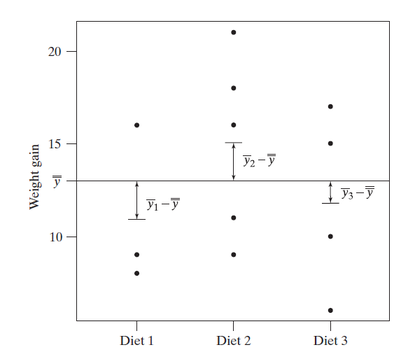
```

> Representa la diferencia entre las medias de cada grupo o tratamiento con respcto a la media global.

---

## ANOVA: Suma de cuadrados dentro de grupos 

$$ SS_{error}= \sum_{i=1}^{a} \sum_{j=1}^{n} (\bar{Y_{ij}} - \bar{Y_i})^2 $$ 

```{r, echo=FALSE,fig.align='center', fig.height=2}
      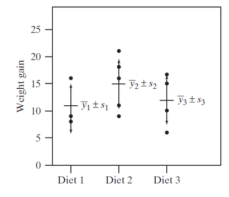
```

> Representa el error aleatorio o variación residual.

---

## ANOVA: Tabla ANOVA

  <span style="display:block; height: 4cm;"></span>
```{r, echo=FALSE,fig.align='center', fig.height=3}
      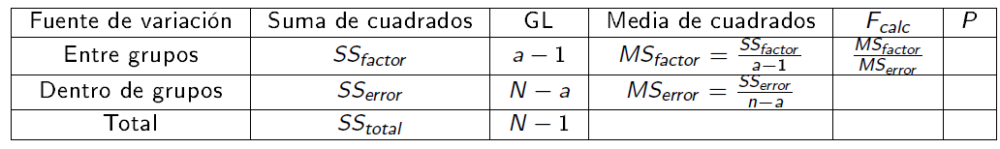
```

---

## ANOVA: Tabla ANOVA

  <span style="display:block; height: 4cm;"></span>
```{r, echo=FALSE,fig.align='center'}
library(xtable)
library(knitr)
      wdata2 = data.frame(
  Tratamiento = factor(rep(c("Nada", "Hongos", 'Solarizada', 'Basamid'), each=200)),
  UFC = c(rnorm(200, 4), rnorm(200, 8), rnorm(200, 4), rnorm(200, 4)))

kable(anova(mod<-lm(UFC~Tratamiento, data=wdata2)), digits = 3)
```

---

## Comprobando Supuestos: Normalidad  

Suponemos que los __errores__ y __las observaciones__, 
dentro de cada grupo provienen de  poblaciones con distribución normal. 

<span style="display:block; height: 1cm;"></span>
     	 	 
$$ H_o: \text{Los residuales están normalmente distribuidos.} $$ 

<span style="display:block; height: 1cm;"></span>

		
> $$ H_a: \text{Los residuales no  están normalmente distribuidos.} $$

<span style="display:block; height: 1cm;"></span> 

>La idea es no rechazar $ H_o $ para asegurar el cumplimiento del supuesto.

---

## Normalidad: Validación gráfica mediante histogramas

Los histogramas, de forma, exploratoria nos permite determinar _simetría_ y 
_modalidad_ en nuestros datos.

```{r, echo=FALSE, message=FALSE, warning=FALSE, fig.align='center', fig.width=14, fig.height=5}
wdata2 = data.frame(
  Tratamiento = factor(rep(c("Nada", "Hongos", 'Solarizada', 'Basamid'), each=200)),
  UFC = c(rnorm(200, 4), rnorm(200, 8), rnorm(200, 4), rnorm(200, 3.5)))


dvpl<-gghistogram(wdata2, x = "UFC",
            add = "mean",
            
            add_density = TRUE) 


norm<-data.frame(
  Tratamiento = factor(rep(c("Nada", "Hongos", 'Solarizada', 'Basamid'), each=200)),
  UFC = c(rnorm(200, 4), rnorm(200, 4), rnorm(200, 4), rnorm(200, 4)))
nopl<-gghistogram(norm, x = "UFC",
            add = "mean", add_density = T
            
            ) 


ggarrange(nopl, dvpl,
          ncol = 2, nrow = 1)
```

---

## Normalidad: Validación gráfica mediante Q-Q plot
Los gráficos __cuantil-cuantil__ o __QQ plot__, nos permite contrastar nuestros datos con una distribución normal teórica.

```{r, echo=FALSE,fig.align='center', fig.width=14, fig.height=3}
      knitr::include_graphics('./assets/img/qqnorm.png')
```


---

## Normalidad: Validación gráfica mediante Q-Q plot
Los gráficos __cuantil-cuantil__ o __QQ plot__, nos permite contrastar nuestros datos con una distribución normal teórica.

```{r, echo=FALSE,fig.align='center', fig.width=14, fig.height=3}
      knitr::include_graphics('./assets/img/qqnormNO.png')
```


---

## Normalidad: Validación mediante Pruebas

 + Shapiro - Wilks  - `shapiro.test()`
```{r}

residuos<-rnorm(100, mean = 5, sd = 3)
shapiro.test(residuos)
```


---

## Comprobando Supuestos: Homocedasticidad

Asumen que la varianza en la variable respuesta es la misma 
en cada nivel, o combinación de los niveles del factor o factores.

> \[H_o: \text{La varianza de $Y$ es igual en cada nivel del factor} \]

<span style="display:block; height: 1cm;"></span>

		
> \[H_a: \text{La varianza de $Y$ no es igual en cada nivel del factor.} \]

<span style="display:block; height: 1cm;"></span> 

>La idea es no rechazar $H_o$ para asegurar el cumplimiento del supuesto.

---


## Homocedasticidad: Validación gráfica mediante Box-plot

```{r, echo=FALSE, message=FALSE, warning=FALSE, fig.align='center'}

wdata2 = data.frame(
  Tratamiento = factor(rep(c("Nada", "Hongos", 'Solarizada', 'Basamid'), each=200)),
  UFC = c(rnorm(200, 4), rnorm(200, 8), rnorm(200, 4), rnorm(200, 3.5)))
ggplot(wdata2, aes(Tratamiento, UFC)) + 
  geom_boxplot(aes(fill = Tratamiento))  + 
  geom_jitter(position = position_jitter(width = .15), alpha=0.3, size=2) +
  xlab("Tratamiento") +
  ylab("Log(UFC/g)") +theme_bw() + theme(legend.position = "none",axis.title.x=element_text(size = 22), 
                                     axis.title.y = element_text(size = 22))
```

---

## Homocedasticidad: Validación gráfica model-plot

```{r, echo=FALSE,fig.align='center', fig.width=14, fig.height=3}
      knitr::include_graphics('./assets/img/homoced.png')
```

---

## Homocedasticidad: Validación mediante pruebas 
### Prueba de Bartlett - `bartlett.test()`
 
```{r, echo=FALSE, message=FALSE, warning=FALSE}

bartlett.test(count ~ spray, data = InsectSprays)


bartlett.test(conformity ~ fcategory, data=Moore)
```

---


## Homocedasticidad: Validación mediante pruebas 
### Prueba de Levene - `LeveneTest()`
 
```{r, echo=FALSE, message=FALSE, warning=FALSE}

with(Moore, leveneTest(conformity, fcategory))
with(Moore, leveneTest(conformity, interaction(fcategory, partner.status)))
leveneTest(conformity ~ fcategory*partner.status, data=Moore)

```

--- bg:black

## Hay vida después de $P < 0.05$...

```{r, echo=FALSE,fig.align='center'}
      knitr::include_graphics('./assets/img/tenorBx2.gif')
```

--- 

## ¿Y qué sigue ahora...? 

```{r, echo=FALSE,fig.align='center'}
      knitr::include_graphics('./assets/img/Confs.gif')
```

----

## Comparaciones múltiples

> + Un resultado significantivo en la ANOVA (__F-test__) nos dice que al menos una de las medias es diferente, _pero no cual de ellas es la realmente distinta_.

> + Por lo tanto, necesitamos una prueba que nos compare todas las muestras, estas son llamadas:<p style="color:blue"> Comparaciones múltiples</p>.

> + Número de comparaciones según los tratamientos: 

\[{k \choose 2} = \frac{k!}{2! (k-2)!} = \frac{k(k-1)}{2} \]

---

## Comparaciones múltiples

```{r, echo=FALSE, message=FALSE, warning=FALSE, fig.align='center', fig.height=7, fig.width=12}
require(ggplot2)
vK<- sapply(0:100, function(x) 1-(0.95)^x)
dfK<-data.frame(K=0:100, vK )

ggplot(dfK, aes(K, vK)) + geom_line() + theme_bw()+ 
  theme(axis.title.x=element_text(size = 22),
        axis.title.y = element_text(size = 22)) + labs(x='Número de comparaciones',
                                                       y='Probabilidad de error') +
  scale_x_continuous(breaks=c(0,10,20,30,40,50,60,70,80, 90, 100)) + 
  scale_y_continuous(breaks=c(0, 0.1, 0.2, 0.3, 0.4, 0.5,0.6,0.7,0.8,0.9,1)) + 
  annotate('text', x=70, y=0.4, label='Probabilidad de obtener un falso positivo 
           \n Nótese que con 60 la Pr es cercana al 95%', colour='blue', size=6)


```

---&vcenter

## 

<q>¿Cuál de las medias es diferente a el nivel de significancia usado ? </q> 

---

## Prueba Honesta de Tukey - Tukey HSD
<span style="display:block; height: 5cm;"></span>
\[HSD = \frac{\bar{x_1} - \bar{x_2}}{\sqrt{\frac{MS_{Dentro}}{n}}}\]


---&twocol

## Prueba Honesta de Tukey - Tukey HSD

*** =left
```{r, echo=FALSE, message=FALSE, warning=FALSE}
wdata4 = data.frame(
  Tratamiento = factor(rep(c("Nada", "Hongos", 'Solarizada', 'Basamid'), each=5)),
  UFC = c(rnorm(5, 4), rnorm(5, 7), rnorm(5, 4), rnorm(5, 2)))


wdata4$Tratamiento<-factor(wdata4$Tratamiento, levels = c('Nada','Hongos','Basamid','Solarizada'))

ggplot(wdata4, aes(Tratamiento, UFC)) + 
  geom_boxplot(aes(fill = Tratamiento))  + 
  geom_jitter(position = position_jitter(width = .15), alpha=0.3, size=2) +
  xlab("Tratamiento") +
  ylab("Log(UFC/g)") +theme_bw() + theme(legend.position = "none",axis.title.x=element_text(size = 22), 
                                     axis.title.y = element_text(size = 22))


```

*** =right

 <span style="display:block; height: 4cm;"></span>
 
```{r, echo=FALSE, message=FALSE}
kable(anova(mod<-lm(UFC~Tratamiento, data=wdata4)), digits = 3)
```


---

## Prueba Honesta de Tukey - Tukey HSD
 <span style="display:block; height: 2cm;"></span>
 
```{r, echo=FALSE}
mod<-lm(UFC~Tratamiento, data=wdata4)
pp<-HSD.test(mod,'Tratamiento', group  = F)
kable(pp$comparison, digits = 3)
```

---

## Prueba de Dunnett 

<span style="display:block; height: 5cm;"></span>

 \[D_{Dunnett} = t_{Dunnett} \sqrt{\frac{MS_{error}}{n}}\]

---

## Prueba de Dunnett 

```{r, echo=FALSE}
summary(glht(mod, linfct=mcp(Tratamiento='Dunnett')))
```

---


