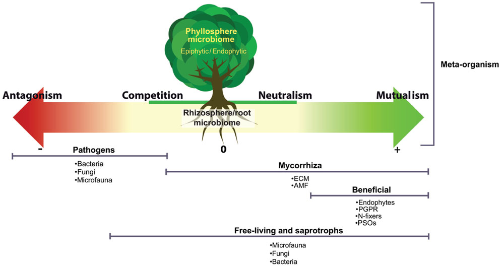
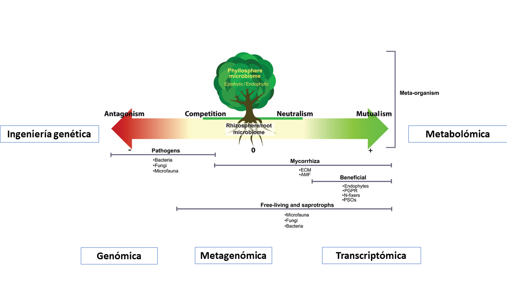
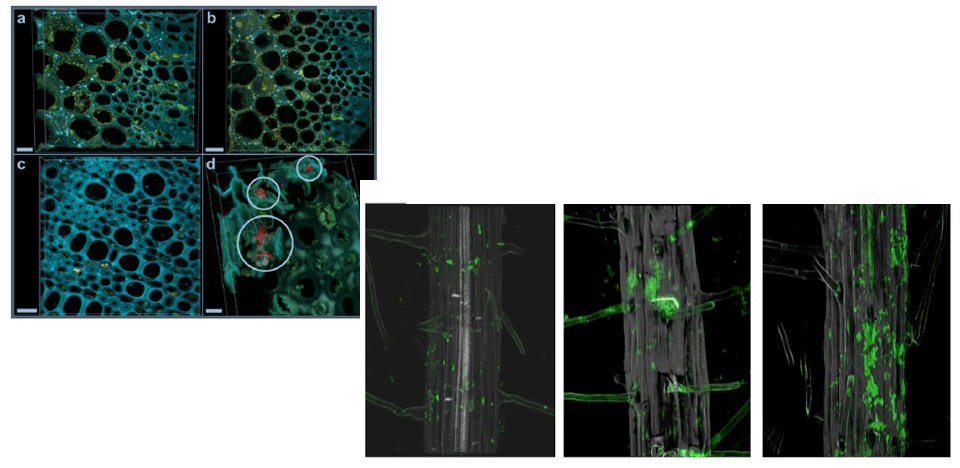
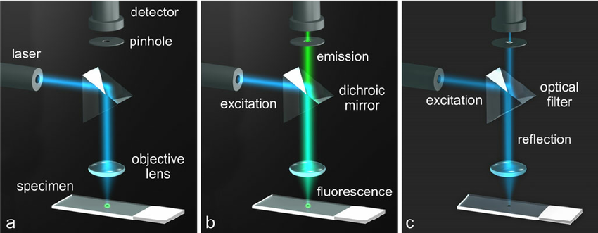
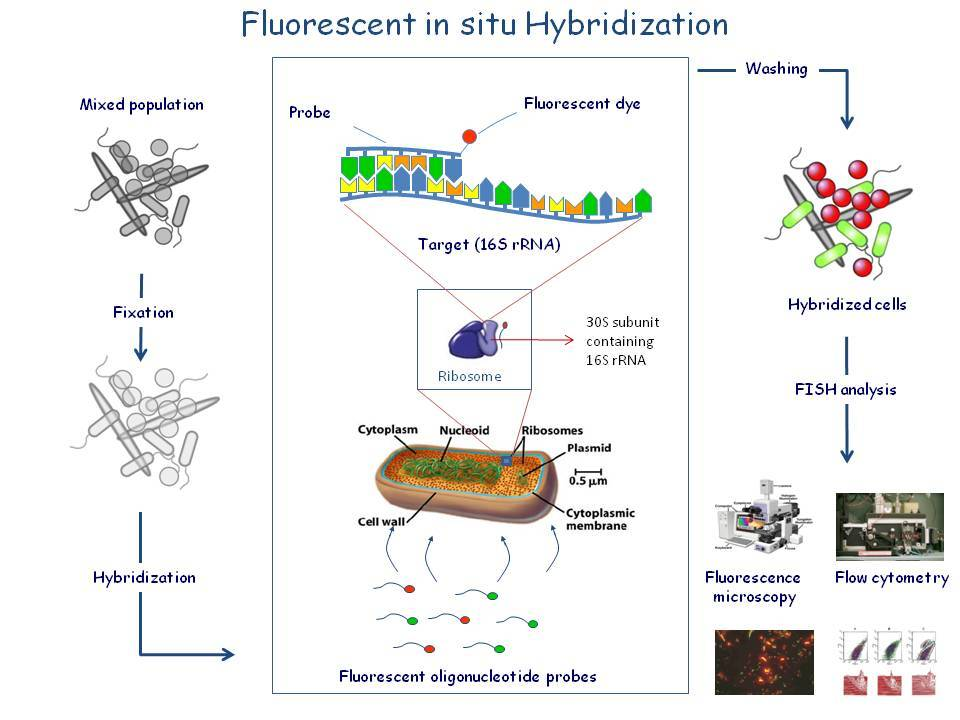
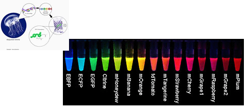
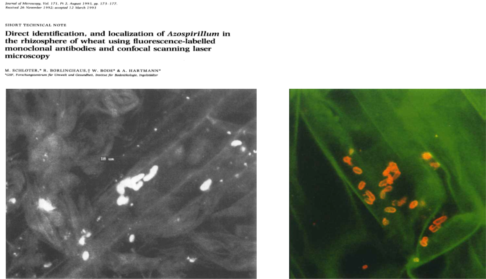

# Microorganismos determinan el éxito de sus hospederos 

```{r, echo=FALSE,fig.align='center', out.width = "750px"}
      
```

.footnote[
Tomado de Quiza et. al (2014)
]
---

# Técnicas moleculares han permitido comprender los mecanismos implicados en la relación P - M 

```{r, echo=FALSE,fig.align='center', out.width = "750px"}
      
```

.footnote[
Adaptado de Quiza et. al (2014)
]

---

## ¿Qué pasa con la distribución espacial y los patrones de colonización? 

```{r, echo=FALSE,fig.align='center', out.width = "750px"}
      
```

.footnote[
Cardinale et. al (2016)
]

---

##  CLSM unas de las técnicas más usadas en el estudio de interación P - M

<iframe width="560" height="315" align="center" src="https://www.youtube.com/embed/QFtZFbug1SA" frameborder="0" allow="accelerometer; autoplay; encrypted-media; gyroscope; picture-in-picture" allowfullscreen></iframe>

---

# Principio CLSM 

```{r, echo=FALSE,fig.align='center', out.width = "750px"}
      
```

---


# El uso de CLSM combinado con técnicas moleculares permite visualizar a escala 'microbiana' 

_CLSM_ permite determinar tres tipos de objetos: (1) Moleculas, Células y tejidos teñidos con fluoroforos; (2) Organismos modificados genéticamente; (3) Autofloresencia

---


## El uso de CLSM combinado con técnicas moleculares permite visualizar a escala 'microbiana' 

CLSM permite determinar tres tipos de objetos: (1) Moleculas, Células y tejidos teñidos con fluoroforos; (2) Organismos modificados genéticamente; (3) Autofloresencia


.pull-left[ __FISH__
Visualización, enumeración y localización de una célula microbiana individual __incluyendo no cultivables.__

```{r, echo=FALSE,fig.align='center', out.width = "400px"}
      
```

.foonote[
https://bit.ly/2RUUheB
]
]

.pull-right[ __Proteínas fluorescentes__
```{r, echo=FALSE,fig.align='center', out.width = "500px"}
      
```

]

---


# Miremos algunos ejemplos... 

## El primer intento 

```{r, echo=FALSE,fig.align='center', out.width = "700px"}
      
```

---

# Miremos algunos ejemplos... 

## El primer intento 


---
