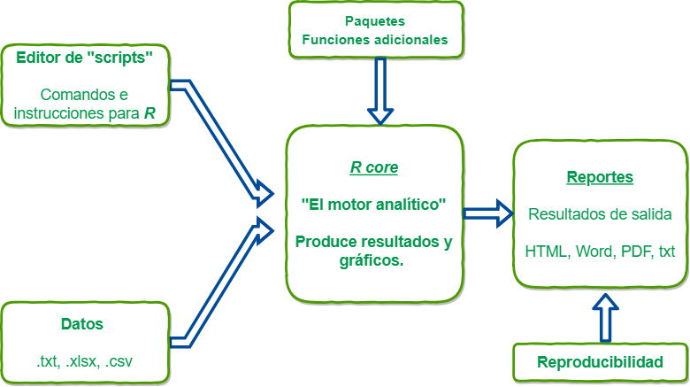

class: center, middle, inverse


# `r emo::ji("1st_place_medal")`

## Organización de datos en hojas de cálculo


---


##  Se consitente `r emo::ji("cake")` ... 


---


## Hablemos de **R**

```{r include=FALSE}
library(utils)
```


```{r, echo=FALSE,fig.align='center'}
      
```
---
# Standard slide with R code

```{r, fig.height=4.5, fig.width=12, fig.retina=2, fig.align='center', message=FALSE, warning=FALSE}
library(tidyverse)
ggplot(cars, aes(x = dist, y = speed)) + 
  {{geom_point()}} + 
{{ geom_smooth(method = 'lm', formula = y ~ poly(x, 2))}} # we can highlight lines of code 
```


---