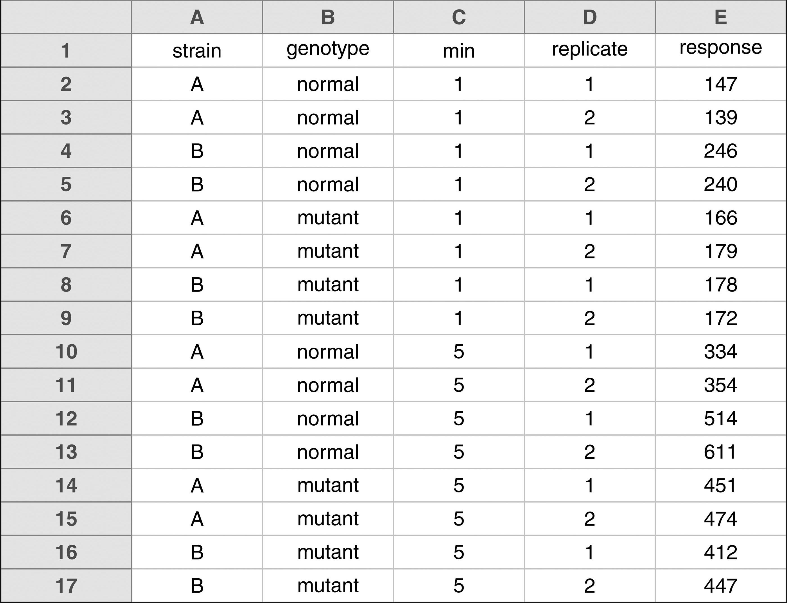
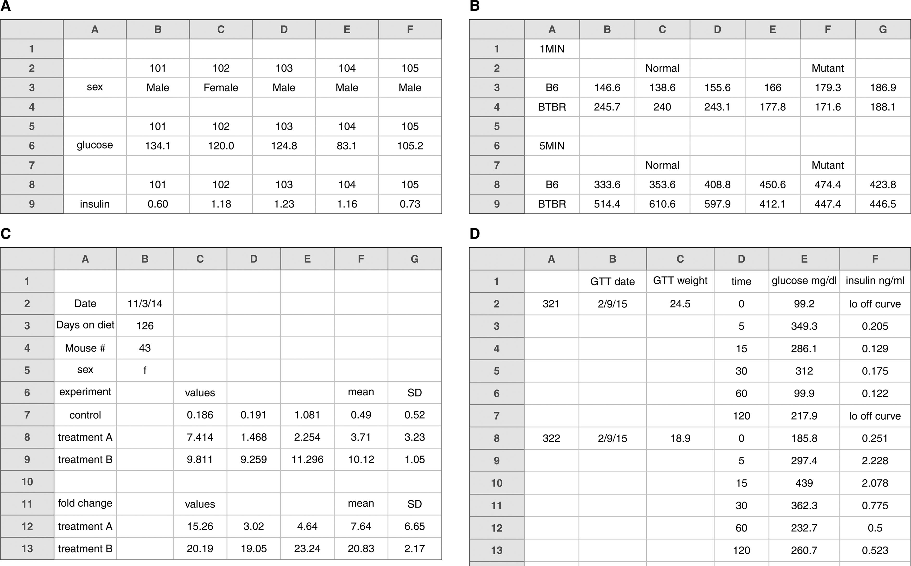
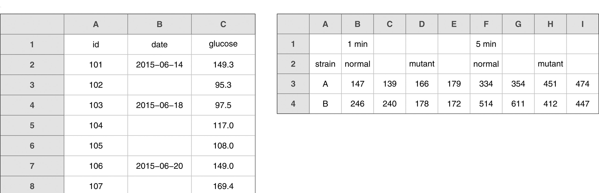
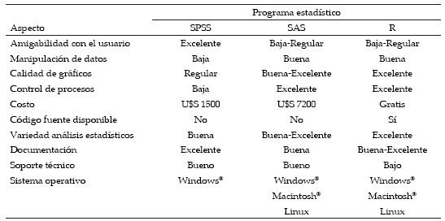
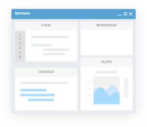
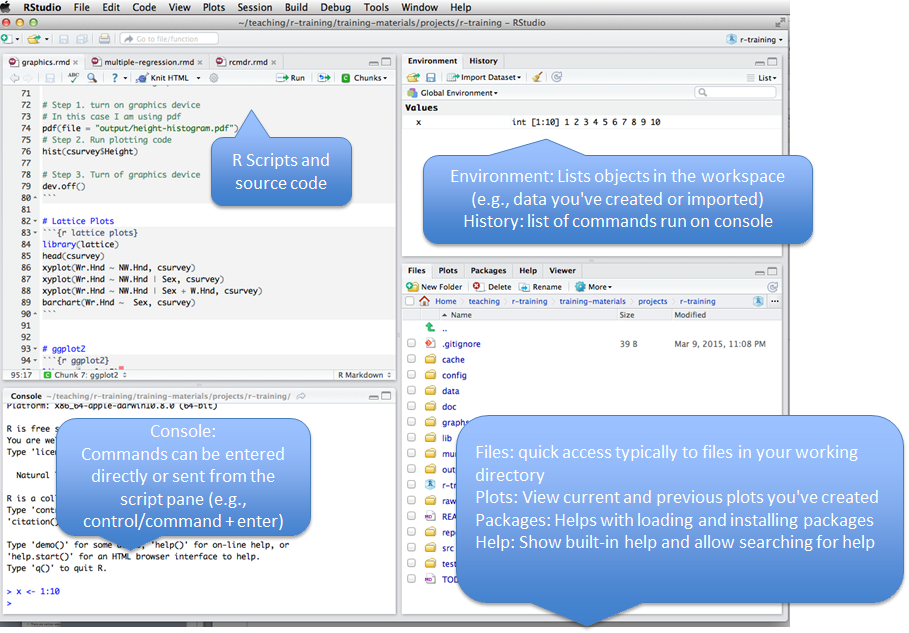

class: center, middle, inverse


# `r emo::ji("1st_place_medal")`

## Organización de datos en hojas de cálculo


---

## Haz un rectángulo 



---

## Haz un rectángulo .... y evita esto `r emo::ji("woman_facepalming")`



---

## No celdas vacías `r emo::ji("warning")`



---

##  Se consitente `r emo::ji("cake")` ... 


.pull-left[

+ Codifica correctamente las variables categóricas
 
+ Usa nombre de _variables_ apropiados
 
+ Codifica adecuadamente los datos perdidos: _NA_ o dejar vacío

+ Evitar cálculos y fórmulas 

+ Evitar comentarios y unidades en las celdas

]

.pull-right[

| Buen nombre  `r emo::ji("clap")`| Alternativa  `r emo::ji("roll_eyes")` | Evitar `r emo::ji("broken_heart")`              |
|--------------------|-------------|---------------------|
| Max_Temp_C         | MaxTempC    | Maximum Temp (◦C)   |
| Cell_Type          | CellType    | Cell Type           |
| Precipicitacion_mm | Precmm      | Precipitacion mm    |
| Growth_rate        | GrowthRate  | Tasa de crecimiento |

]


---

## `r emo::ji("muscle")` Ejercicio 1

1. Descarga los datos dando [click aquí](https://drive.google.com/file/d/1KX1T63wTuE29yq8nNQz-blTiQyGbZaXV/view?usp=sharing)

2. Abrir en Excel 

3. El archivo contiene 2 hojas. Las cuales corresponden a muestreo realizados en `2013` y `2014` por investigadores diferente. Cada uno tomó los datos a su manera. 

4. Con sus compañeros de fila, identifique los principales problemas del libro y construya una hoja nueva conjunta corregida. 

---


## Ejercicio 1: Solución 

```{r, echo=FALSE,fig.align='center', out.width = "500px"}
      knitr::include_graphics('./img/good_formatting.png')
```

---


class: center, middle, inverse


# `r emo::ji("2nd_place_medal")`

## Introducción a `R` 


---


## Hablemos de `R`

```{r include=FALSE}
library(utils)
```


```{r, echo=FALSE,fig.align='center', out.width = "900px"}
      knitr::include_graphics('./img/R.png')
```

---

##  ... Se paciente `r emo::ji("rocket")`

```{r, echo=FALSE,fig.align='center', out.width = "800px"}
      knitr::include_graphics('./img/Rcurve.png')
```

---

## Hablemos de **R**

```{r, echo=FALSE,fig.align='center', out.width = "800px"}
      
```

---

## Hablemos de **R**

```{r, echo=FALSE,fig.align='center', out.width = "800px"}
      knitr::include_graphics('./img/Rscholar.png')
```

---
## Instalación de **R**

Podemos instalar **R** desde el siguiente link: https://www.r-project.org/


|Sistema Operativo | Método   |
|------------------|----------|
|   Windows        | https://cran.r-project.org/bin/windows/base/old/3.4.2/R-3.4.2-win.exe |
|Debian y derivados|`sudo apt-get install r-base`                           |
|Redhat y derivados| `sudo yum install R-core R-devel`                      |
|     Mac          | https://www.youtube.com/watch?v=ICGkG7Gg6j0            |

---

## Entornos de desarrollo para R

Una vez instalado, un entorno de desarrollo integrado será necesario para facilitar el desarrollo de códigos en **R**, por lo que se presentan tres de varias opciones para trabajar con **R**. 

|       IDE             |  Link     |
|:---------------------:|-----------|
|   Tinn-R              |https://sourceforge.net/projects/tinn-r/ |
|R-Studio [Recomendado] |https://www.rstudio.com/ |
| R commander (Rcmdr)   |http://www.rcommander.com/ |


```{r, echo=FALSE,fig.align='center', out.width = "300px"}
     
```

---

## Rstudio


```{r, echo=FALSE,fig.align='center',out.width = "700px"}
      
```

---


## Flujo de trabajo  sugerido en Rstudio

```{r, echo=FALSE,fig.align='center', out.width = "800px"}
      knitr::include_graphics('./img/rcore.png')
```

---

## Flujo de trabajo sugerido en Rstudio

```{r, echo=FALSE,fig.align='center',out.width = "800px"}
      knitr::include_graphics('./img/rcore.png')
```
---


# Standard slide with R code

```{r, fig.height=4.5, fig.width=12, fig.retina=2, fig.align='center', message=FALSE, warning=FALSE}
library(tidyverse)
ggplot(cars, aes(x = dist, y = speed)) + 
  {{geom_point()}} + 
{{ geom_smooth(method = 'lm', formula = y ~ poly(x, 2))}} # we can highlight lines of code 
```


---