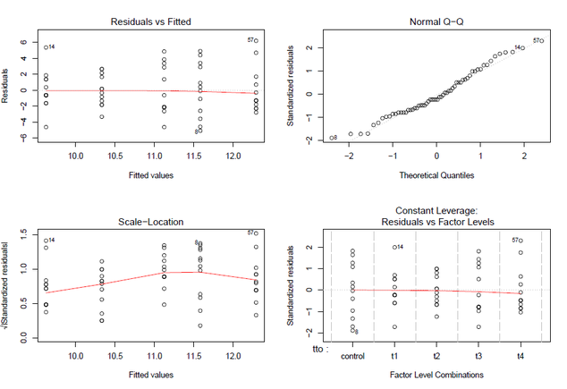
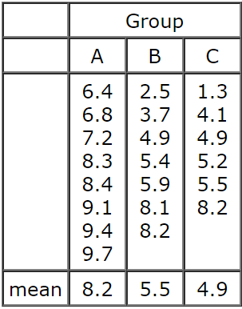
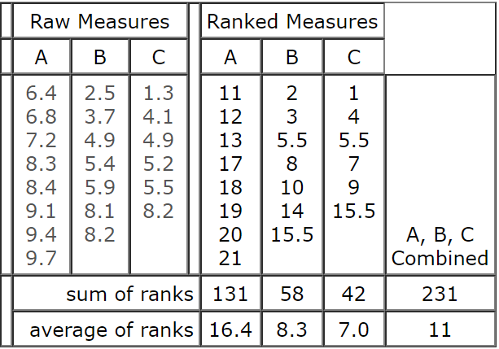
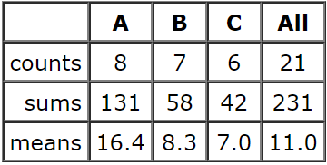

## Supuestos ANOVA


```{r, echo=FALSE, message=FALSE, warning=FALSE, fig.align='center'}
library(ggpubr)
wdata3 = data.frame(
  Tratamiento = factor(rep(c("Nada", "Hongos", 'Solarizada', 'Basamid'), each=200)),
  UFC = c(rnorm(200, 4), rnorm(200, 4), rnorm(200, 4), rnorm(200, 4)))


gghistogram(wdata3, x = "UFC",
            add = "mean", rug = TRUE,
            fill = "Tratamiento",
            add_density = TRUE, xlab = 'UFC/g', ylab = 'Frecuencia')
```


---

## Supuestos ANOVA


```{r, echo=FALSE, message=FALSE, warning=FALSE, fig.align='center'}

```

---

## ¿Y qué pasa si fallan.... ?

```{r, echo=FALSE,fig.align='center'}
      
```

---


## Prueba de Kruskal - Wallis 

 + Método no paramétrico que permite comparar, en un solo test, los __rangos medios__ de un conjunto de k muestras independientes.
 
 + Análogo a la ANOVA de una vía 
 
 + Útil cunado no se cumplen supuestos de normalidad y homogeneidad de varianzas

  + Una buena opción cuando se tiene muestra pequeña

---

## ¿ Cómo funciona ? 

```{r, echo=FALSE,fig.align='center', out.width = "400px"}
      
```

---

## ¿ Cómo funciona ? 

```{r, echo=FALSE,fig.align='center', out.width = "600px"}
      
```

---

## ¿ Cómo funciona ? 

$$ SS_{factor} = \sum \Big[n_g(Med_g - Med_{total})^2 \Big]$$

```{r, echo=FALSE,fig.align='center'}
      
```

---


## Kruskal - Wallis estadístico _H_

$$ H=\frac{SS_{factor}}{N(N+1)/12} $$
 + Si el tamaño de grupos k es igual a 3 y el número de observaciones en cada uno no es mayor que 5, se recurre a tablas tabuladas con valores teóricos de H.
 
+ En el resto de casos se asume que el estadístico H sigue una distribución $\chi^2$ con k-1 grados de libertad (siendo k el número de grupos a comparar).

---

# Un ejemplo 

```{r echo=FALSE, message=FALSE, warning=FALSE, fig.align='center'}
require(ggplot2)
ggplot(data = airquality, mapping = aes(x = factor(Month), y = Ozone, colour = factor(Month))) + 
    geom_boxplot() + theme_bw() + theme(legend.position = "none")
```

---

# Un ejemplo 

```{r echo=FALSE, message=FALSE, warning=FALSE, fig.align='center'}
ggplot(data = airquality, mapping = aes(x = Ozone, colour = factor(Month))) + geom_histogram() + 
    theme_bw() + facet_grid(. ~ factor(Month)) + theme(legend.position = "none")
```

---

## Un ejemplo 

```{r include=FALSE}
mod.O<-lm(Ozone~factor(Month), airquality)


```


.pull-left[

## Normalidad

```{r}
shapiro.test(mod.O$residuals)
```


]

.pull-right[

## Q-Q plot 
```{r}
qqnorm(mod.O$residuals); qqline(mod.O$residuals)
```

]

---

# Un ejemplo

```{r echo=FALSE, message=FALSE, warning=FALSE}
library(agricolae)
```

```{r}
kruskal(airquality$Ozone, as.factor(airquality$Month), console = T)
```

---

