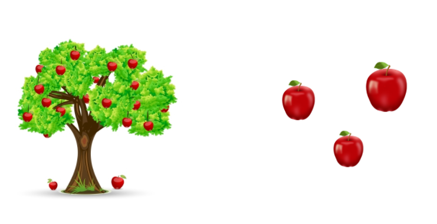
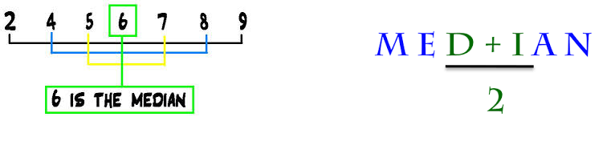

## Datos

En estadística, 'los datos' se conceptualizan como un conjunto de  <span style="color:#FF4000">objetos</span> sobre los cuales medimos u observamos una o más <span style="color:#DF0101">características </span>. 


```{r, echo=FALSE,fig.align='center'}
      knitr::include_graphics('./img/data2.jpg')
```
---

## Variables
 
 <span style="display:block; height: 2cm;"></span>

<q> Una característica o atributo que puede  <span style="color:#FF4000">variar</span>  de un individuo a otro. </q>

---

## Variables

.pull-left[

- <span style="color:orange">Inviduo </span>
- Observación
- sujeto
- objeto
- caso
- **Unidad experimental**

]

.pull-right[
- <span style="color:orange">Variables </span>
- Característica
- Atributo
- Rasgo
]

---

## Variable

```{r, echo=FALSE,fig.align='center'}
      knitr::include_graphics('./img/flujo.jpg')
```
---

## Variable


```{r, echo=FALSE,fig.align='center'}
      knitr::include_graphics('./img/Var.jpg')
```
---


class: center, middle, inverse

## Estadística descriptiva


---

## Caso 1: Unas cuantas manzanas.... 

```{r, echo=FALSE,fig.align='center'}
      
```

---

## Caso 1: Unas cuantas manzanas.... 

```{r, echo=FALSE,fig.align='center'}
      knitr::include_graphics('./img/2.png')
```

---


## Caso 2: Unas cuantas manzanas.... 


```{r, echo=FALSE,fig.align='center'}
      knitr::include_graphics('./img/3.png')
```

---

## Caso 2: Unas cuantas manzanas.... 


```{r, echo=FALSE,fig.align='center', out.width = "800px"}
      knitr::include_graphics('./img/4.png')
```

---

## Caso 3: Muchas más manzanas....


```{r, echo=FALSE,fig.align='center', out.width = "700px"}
      knitr::include_graphics('./img/5.png')
```

---

## Caso 3: Muchas más manzanas....


```{r, echo=FALSE,fig.align='center', out.width = "700px"}
      knitr::include_graphics('./img/6.png')
```

---


## Tablas de frecuencia

```{r, echo=FALSE,fig.align='center', out.width = "600px"}
      knitr::include_graphics('./img/fre.png')
```

---

## Tablas de frecuencia 


| Acidity | Conteo |
|:-------:|:------:|
|Low      |    23    |
|Medium     |   12     |
|High         |  35      |


---

## Resumiendo variables numéricas...

```{r, echo=FALSE,fig.align='center'}
      knitr::include_graphics('./img/flujoMed.jpg')
```

---

## Medidas de tendencia central 

<span style="display:block; height: 2cm;"></span>

- Media: Promedio

- Mediana: Punto medio o central 

- Moda: Más común o frecuente

---


## Media 

$$\bar x = \frac{1}{n}\sum_{i = 1}^{n} x_i$$


```{r, echo=FALSE,fig.align='center'}
      knitr::include_graphics('./img/media.png')
```

---

## Mediana 

Es el punto medio o central de una distribución ordenada de valores. 


```{r, echo=FALSE,fig.align='center'}
      knitr::include_graphics('./img/mediana.png')
```

```{r, echo=FALSE,fig.align='center'}
      
```

---


## Variables categóricas: Representación gráfica
### Gráfico de tortas
```{r, echo=FALSE,warning=FALSE,message=FALSE,fig.align='center'}
library(ggpubr)
df <- data.frame(
 group = c("Male", "Female", "Child"),
  value = c(25, 25, 50))
labs <- paste0(df$group, " (", df$value, "%)")
ggpie(df, "value", label = labs,
   fill = "group", color = "white",
   palette = c("#00AFBB", "#E7B800", "#FC4E07"))

```

---

## Variables categóricas: Representación gráfica
### Gráfico de barras
```{r, echo=FALSE,warning=FALSE,message=FALSE,fig.align='center'}
library(ggpubr)
df <- data.frame(dose=c("D0.5", "D1", "D2"),
   len=c(4.2, 10, 29.5))

# Basic plot with label outsite
# +++++++++++++++++++++++++++
ggbarplot(df, x = "dose", y = "len",
  label = F, label.pos = "out")

```

---

class: center, middle, inverse

## Análisis exploratorio de datos (EDA)


---

## Análisis exploratorio de datos `r emo::ji("goal")`


<blockquote> 
" EDA no es un proceso formal con un conjunto estricto de reglas. Más que nada, EDA es un estado de ánimo. Durante las fases iniciales de EDA, debería sentirse libre de investigar cada idea que se le ocurra. Algunas de estas ideas se desarrollarán y otras serán callejones sin salida. A medida que continúe su exploración, se concentrará en algunas áreas particularmente productivas que eventualmente escribirá y se comunicará con otros."
</blockquote>


1. Generar preguntas a partir de los datos 

2. Buscar respuestas mediante la visualización de los datos

3. Refinar hipótesis o formular nuevas
---


## Análisis exploratorio de datos: Histograma

```{r, echo=FALSE,warning=FALSE,message=FALSE, fig.align='center'}
library(ggpubr)
# Create some data format
set.seed(1234)
wdata = data.frame(
   sex = factor(rep(c("F", "M"), each=200)),
   weight = c(rnorm(200, 55), rnorm(200, 58)))
# Combine histogram and density plots
gghistogram(wdata, x = "weight",
   add = "mean", rug = TRUE,
   fill = "sex", palette = c("pink", "blue"),
   add_density = TRUE)

```

---

## Dot plots o gráficos de puntos


```{r, echo=FALSE,warning=FALSE,message=FALSE, fig.align='center'}
library(ggpubr)
# Load data
data("ToothGrowth")
df <- ToothGrowth

# Basic plot with summary statistics : mean_sd
# +++++++++++++++++++++++++++
ggdotplot(df, x = "dose", y = "len",
   add = "mean_sd",color='blue')

```
--- 

## Boxplot o Cajas y bigotes

```{r, echo=FALSE,fig.align='center'}
      
```

---


## Boxplot o Cajas y bigotes 

```{r, echo=FALSE,fig.align='center'}
      
```

---

## Boxplot o Cajas y bigotes

```{r, echo=FALSE,warning=FALSE,message=FALSE,fig.align='center'}
library(ggpubr)
# Load data
data("ToothGrowth")
df <- ToothGrowth

# Add jitter points and change the shape by groups
ggboxplot(df, x = "dose", y = "len",
   add = "jitter", shape = "dose")


```

---

## Scatterplot o Gráfico de dispersión 


```{r, echo=FALSE,warning=FALSE,message=FALSE, fig.align='center'}
# Load data
data("mtcars")
df <- mtcars
df$cyl <- as.factor(df$cyl)


# Basic plot
# +++++++++++++++++++++++++++
ggscatter(df, x = "wt", y = "mpg",
   color = "black", shape = 21, size = 3, # Points color, shape and size
   add = "reg.line",  # Add regressin line
   add.params = list(color = "blue", fill = "lightgray"), # Customize reg. line
   conf.int = TRUE, # Add confidence interval
   cor.coef = TRUE # Add correlation coefficient
   )
```

---

# Ejercicio

1. Cada fila debe tomar unos de los siguientes set de datos contenidos en R:

 + Fila 1: ?iris
 + Fila 2: ?mtcars
 + Fila 3: ?ToothGrowth
 + Fila 4: ?CO2
 + Fila 5: ?airquality  
 + Fila 6: ?diamonds
 + Fila 7: ?Loblolly
 
2. Conducir un análisis descriptivo
3. Conducir un análisis exploratorio donde se planteen al menos dos preguntas respaldas con sus respectivas gráficas.  
4. Una Presentación flash en PowerPoint de 3 minutos

