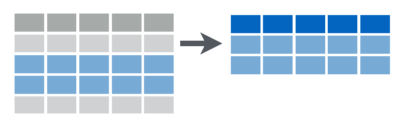
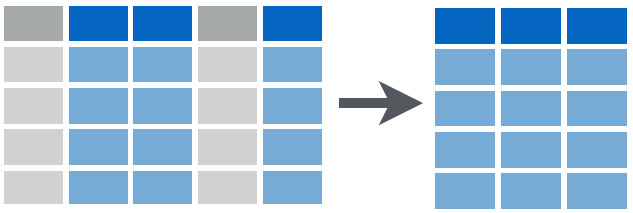
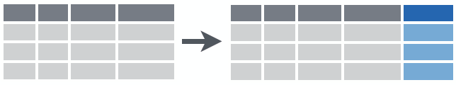
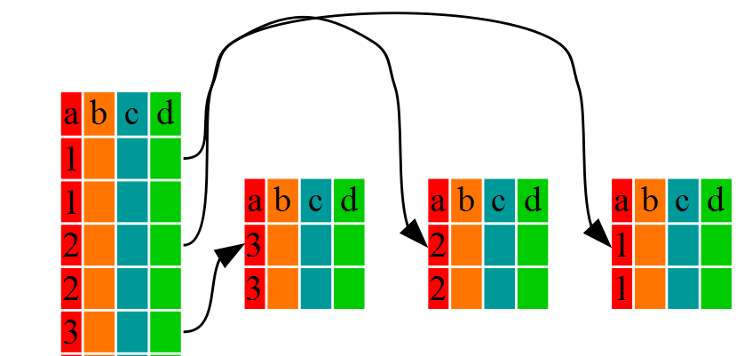

## Manipulación de datos con `dplyr`

`dplyr` es un paquete para manipulación de datos que proporciona un conjunto coherente de verbos para resolver los desafíos más comunes de manipulación de datos:

### Instalación 

```{r, eval=F}
install.packages('dplyr')
```


### Verbos 

+ `filter()`: selección filas  
+ `mutate()`: Crea una nueva columna
+ `select()`: selecciona columnas
+ `arrange()`: reordena filas
+ `group_by()`: Crea grupo dada una condición 
+ `join()`: Junta diferente _dataframes_
+ `summarise()`: Genera resumenes

---

## `filter()`

Útil cuando se desea filtar _filas_ que satisfacen una condición particular.

```{r, echo=FALSE,fig.align='center', out.width = "500px"}
      
```

.pull-left[

```{r, eval=F}
filter(datos, #<<
       status=='Active')
```
]

.pull-right[
+ El primer argumento es el `dataframe` que se desar filtar. 
]

---


## `filter()`

Útil cuando se desea filtar _filas_ que satisfacen una condición particular.

```{r, echo=FALSE,fig.align='center', out.width = "500px"}
      
```

.pull-left[ 

```{r, eval=F}
filter(datos, 
       status=='Active') #<<
```
]

.pull-right[ 

+ El primer argumento es el `dataframe` que se desar filtar. 

+ El seugndo es la condicón que se desea satisfacer. 
]

---


## `filter()`


```{r, echo=FALSE,fig.align='center', out.width = "500px"}
      
```

.pull-left[ 

```{r, eval=F}
filter(datos,
       status=='Active' & 
         smoker=='Si')
```
]

.pull-right[ 

`r emo::ji("thinking")` `r emo::ji("thinking")`  `r emo::ji("thinking")`
`r emo::ji("thinking")` `r emo::ji("thinking")`  `r emo::ji("thinking")`
]

---

## `filter()`


```{r, echo=FALSE,fig.align='center', out.width = "500px"}
      
```

.pull-left[ 

```{r, eval=F}
filter(datos,
       status=='Active' & 
         smoker=='Si')
```
]

.pull-right[ 

Se filtra por dos condicones o más usando los operadores `&` o `|`. 
]

---


## `filter()`


Las condiciones puede ser evaluadas usando los siguientes operadores: 

+ `==`: Igual a
+ `!=`: No igual a
+ `>, >=`: Mayor a, Mayor o igual 
+ `<, <=`: Menor a, Menor o igual a

---

## `filter()`

 + Generemos un subconjuto con los _hombres sedentarios_ y peso mayor a _80_: 

.pull-left[


```{r }
datos<-
  read.csv('Datos/datosS1.csv'
           ,header = T,
           sep = ';')

```

]

.pull-right[
```{r include=FALSE}
library(dplyr)
datos<-read.csv('Datos/datosS1.csv',header = T, sep = ';')
attach(datos)
```

```{r message=FALSE, warning=FALSE}

datos1<- #<< Nuevo data frame
  filter(datos, #<< Data frame 
         sex=='Masculino' &  #<< Condición 1
         status=='Sedentary', #<< Condicón 2
         weight>80 )#<< Condicón 3


```


]


```{r}
head(datos1)
```


--- 


## `filter()`...... tu turno 

```{r, echo=FALSE,fig.align='center',out.width = "400px"}
      knitr::include_graphics('https://media.giphy.com/media/xT0xeCI09WVWUXS3gk/giphy.gif')
```
---


## `filter()`.... tu turno 

```{r, echo=FALSE,fig.align='center',out.width = "400px"}
      knitr::include_graphics('https://media.giphy.com/media/xT0xeCI09WVWUXS3gk/giphy.gif')
```

 <span style="display:block; height: 0.5cm;"></span>

+ Cree un subconjuto llamado `datos2` donde se incluyan *Mujeres no fumadoras no mayores a 50 años y con una duración mayor a 50*.

+ Cree un subconjuto llamado `datos3` donde se incluyan individuos fumadores con peso entre 55 y 80.
---


## `select()`

Permite obtener `columnas` que cumplen una condición. El primer argumento es el `dataframe` y los argumentos subsequentes las columnas que se desean obtener.

```{r, echo=FALSE,fig.align='center', out.width = "500px"}
      
```


.pull-left[
### Para seleccionar

```{r, eval=FALSE}
select(datos, var1, var2, var3)
```
]

.pull-right[

### Para remover 

```{r, eval=FALSE}
select(datos, -var1, -var2)
```

]

---


## `select()`

Algunas funciones de selección adicional y útiles 

| Función       	| Descripción                         	|
|---------------	|-------------------------------------	|
| starts_with() 	| Empieza con un prefijo              	|
| ends_with()   	| Termina con un prefijo              	|
| contains()    	| Contiene una cadena de texto        	|
| num_range()   	| Numerical range like x01, x02, x03. 	|
| everything()  	| All variables.                      	|

---


## mutate()

Esta función agrega una nueva columna al `dataset`. 

```{r, echo=FALSE,fig.align='center', out.width = "500px"}
      
```

```{r, eval=FALSE}
mutate(datos, 
       logHb=log(heartbeat)) #<<
```

---


## mutate() ..... tu turno 

```{r, echo=FALSE,fig.align='center',out.width = "400px"}
      knitr::include_graphics('https://media.giphy.com/media/5AcR8w022Gk4E/giphy.gif')
```
<span style="display:block; height: 2cm;"></span>


+ Cree un conjunto de datos llamados `datos5` donde se crea una variable nueva: `VR` que contenga el cociente entre `oxygen` y `duration`. 

---

## `summarize()`
 
Útil para agregar o resumir. A menudo usado en conjunto con otras funciones como: 

.pull-left[
```{r, echo=FALSE,fig.align='center', out.width = "500px"}
      
```
]

.pull-right[
```{r, echo=FALSE,fig.align='center', out.width = "500px"}
      
```
]


### Funciones útiles 

+ `n()`: Cuenta el número de registros
+ `mean()`: Calcula el promedio
+ `median()`: Calcula la mediana
+ `sd()`: Calcula desviación estándar
+ `max()`: Busca el valor máximo
+ `min()`: Busca el valor mínimo
+ `sum()`: Suma todo los valores
+ `n_distinct`: Número de valores distinto en un vector

---

## `summarize()`
 
```{r, eval=FALSE}

summarize(datos, mean(oxygen))
```
 
```{r, eval=FALSE}

summarize(datos, r=cor(oxygen, age))
```

---

## group_by()

Permite agrupar los datos por los niveles de una variable categórica y aplicar, posteriomente, otras funciones

```{r, echo=FALSE,fig.align='center', out.width = "500px"}
      
```

```{r, eval=FALSE}
group_by(datos, status)
```

---

##  Combinando `group_by()` y `summarise()`
```{r}
summarize(group_by(datos, status), ProHeart=mean(heartbeat), sdHeart=sd(heartbeat))
```
---


## Ordenes concatenadas usando `%>%`

```{r, echo=FALSE,fig.align='center', out.width = "500px"}
      knitr::include_graphics('./img/pipe.jpg')
```

---

## Ordenes concatenadas usando `%>%`

El operador `%>%` , del paquete magrittr,  permiter enlazar funciones del tal forma que se ejecuente de forma continua..
```{r include=FALSE}
library(dplyr)
```

```{r}
datos6<-datos %>% group_by(status)  %>%
  summarise(ProHeart=mean(heartbeat), sdHeart=sd(heartbeat))

datos6
```

---

## Combinando `group_by()`, `summarise()` y `%>%` ... tu turno
```{r, echo=FALSE,fig.align='center',out.width = "300px"}
      knitr::include_graphics('https://media.giphy.com/media/xRFiDPIVR2Dfy/giphy.gif')
```


>0. Cree un conjunto de datos llamado `datos7`
>1. Selecciones sólo las mujeres (sex: Femenino)
>2. Agrupe por `smoker` (Si, No)
>3. Obtenga una variable nueva llamada  `r` donde calcule el coeficiente de correlación `cor()` entre `duration`y `heartbeat`. 
>4. Agregue la variable `r` a `datos7`
---

## Respuesta
```{r}
datos7<-datos %>% filter(sex=='Femino') %>% group_by(smoker) %>%
    summarise(r=cor(duration, heartbeat)) %>%mutate(r)
```

---


## Combinando `group_by()`, `summarise()` y `%>%` ... tu turno


```{r, echo=FALSE,fig.align='center',out.width = "300px"}
      knitr::include_graphics('https://media.giphy.com/media/xRFiDPIVR2Dfy/giphy.gif')
```

¿ Cuál es el promedio de `heartbeat`para hombres fumadores que tuvieron una duration mayor a 600? 


+ Cree un conjunto de datos llamado `datos8`


--- 
